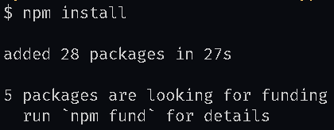
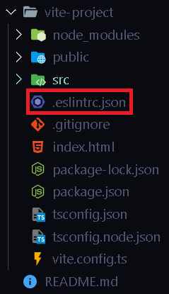
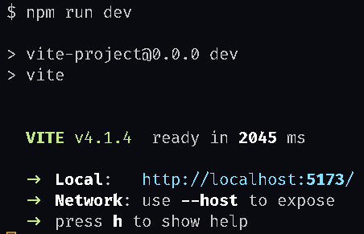

## **Pasos para crear nuevo proyecto en:**

* [vite](https://vitejs.dev/guide/)
* react
* typescript
* [eslint-config-airbnb-typescript](https://www.npmjs.com/package/eslint-config-airbnb-typescript)

**1** Situar terminal en carpeta raiz del proyecto:

`cd rutaCarpetaRaizProyecto`

**2** Instalar vite+react+typescript

`npm create vite@latest`

La terminal me hace las sigientes preguntas:

Escribir el nombre del proyecto, lo voy a dejar con su nombre por defecto


La libreria es React


Seleccionar **TypeScript + SWC** para poder convertir (transpilar) codigo de TypeScript a JavaScript


**3** Se crea una carpeta con el nombre del proyecto, que su nombre por defecto es vite-project


**4** Abrir en la terminal la carpeta vite-project

`cd vite-project`


**5*** Instalar paquetes que seleccione al crear proyecto de vite

`npm install`



**6** Instalar eslint-config-airbnb-typescript

`npm i eslint-config-airbnb@latest @typescript-eslint/eslint-plugin@latest @typescript-eslint/parser@latest eslint-config-airbnb-typescript@latest -D`

**7** En la carpeta raiz del proyecto crear un archivo que se llame .eslintrc.json



**8** Dentro de .eslintrc.json copiar y pegar lo siguiente:

```
{
  "extends": [
    "airbnb",
    "airbnb-base",
    "airbnb-typescript",
    "airbnb/hooks",
    "plugin:@typescript-eslint/recommended",
    "plugin:@typescript-eslint/recommended-requiring-type-checking"
  ],
  "parserOptions": {
    "project": "./vite-project/tsconfig.json",
    "ecmaVersion": "latest",
    "sourceType": "module"
  },
  "settings": {
    "import/resolver": {
      "node": {
        "extensions": [".js", ".jsx", ".ts", ".tsx"]
      }
    }
  },
  "rules": {

  }
}
```

**9** Al archivo tsconfig.json que esta en la carpeta raiz del proyecto agregarle lo siguiente:

```
"parserOptions": {
  "project": "./tsconfig.json"
}
```

**10** npm run lint ejecuta el linter y npm run lint:fix corrige (si es posible) automaticamente los errores.

Al archivo package.json que esta en la carpeta raiz del proyecto agregarle lo siguiente:

```
"scripts": {
  "dev": "vite",
  "build": "tsc && vite build",
  "preview": "vite preview",
  "lint": "eslint --ext .js,.jsx,.ts,.tsx .",
  "lint:fix": "eslint --ext .js,.jsx,.ts,.tsx --fix ."
},
```

**11** Verificar que el linter funcione:

`npm run lint`

**X*** Inicializar proyecto de React en localhost, en la terminal se muestra el puerto:

`npm run dev`


